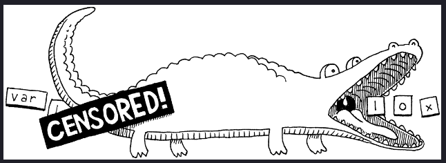

### Crafting interpreters

Working through the delightful [book](https://craftinginterpreters.com/).

#### Chapter 4

- use `switch` statements with [disjoint branches](https://horstmann.com/unblog/2020-02-04/index.html) to break free 
  from myriad `break`s
  ```java
    case '(' -> addToken(LEFT_PAREN);
    case ')' -> addToken(RIGHT_PAREN);
    // ...
    case ' ', '\r', '\t' -> {}       // whitespace
    case '\n' -> line++;             // line ending
    // ...
    default -> { ... }
  ```

- logically, scanner can be thought of as `Source => Stream[Token]`

  

#### Chapter 5

- `sealed` traits and pattern matching y'all